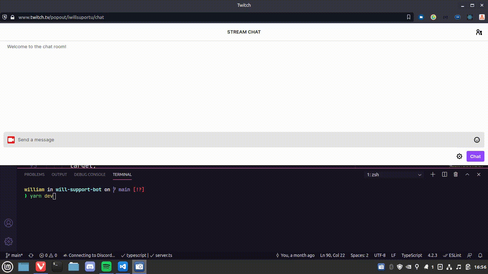

<h1 align="center">Will Support Bot</h1>
<p align="center">My bot for twitch made with 💜 and TypeScript.</p>




## Table of Contents
- [Inspiration](#inspiration)
- [Why?](#why?)
- [Installing](#installing)
- [Technologies](#techs)
### Inspiration

When i started my live streams, i'm always thinking in add a bot to display my elo and some others message than you're already familiarize. But i don't like the way public bots works, so i built my own. 🤗

### Techs

- [Node.JS](nodejs.org)
- [Riot Games Developer](developer.riotgames.com/)
- [Tmi.js](https://tmijs.com)
- [TypeScript](www.typescriptlang.org)
- [Insomnia](insomnia.rest)
- [Ts-Node-Dev](github.com/wclr/ts-node-dev)

### Installing

```shell
# Clone
$ git clone git@github.com:williamtorres1/will-support-bot.git

# Access the folder
$ cd will-support-bot

# Install the dependencies
$ yarn

# Run
$ yarn dev

# The bot will run on port 3333 - <http://localhost:3333>

```

You'll need some things to run this project:

1. A Twitch account
1. Register a new application on [twitch developer](dev.twitch.tv/console/apps/create)
1. A Riot Games account
1. A development [api key](developer.riotgames.com)

Create a `.env` file and copy the content on `.env.example`, replacing with the informations you got and want.


Enjoy and have fun with your new bot!
